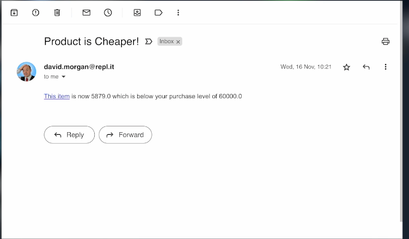

# 👉 Day 100 Challenge

Today's challenge is to create a super useful price scraper.

*NOTE: Amazon is really good at spotting scrapers, so you'll soon be noticed and your IP will be blocked. Try a different product website instead.*

Also, if you want this to constantly be on, you'll need a paid for service from Replit.

Your code should:

1. Use a dictionary to store a product's current price and a price at which you'd be willing to buy them.
2. Every day, scrape the page for price changes.
3. If the price has changed and it's under your 'I'd buy that for a dollar' price, automate an email to be sent to yourself.
4. The email should contain:
    1. A link to the product
    2. A reminder of your desired price
    3. The current price


Example:


<details> <summary> 💡 Hints </summary>
  
- Use `.replace` to update prices in the dictionary.
- Here's a bit of code to send the email if the price is cheaper. `emailMe` is a subroutine.
```python
if thisPrice != price:
      db[key]["price"] = thisPrice
      if thisPrice <= level:
        print("Cheaper")
        emailMe(level, price, url)
```

</details>